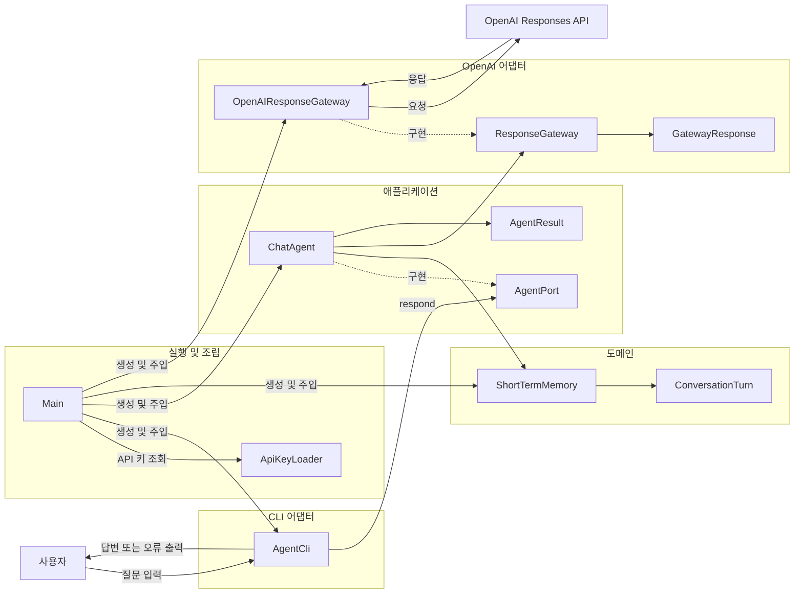
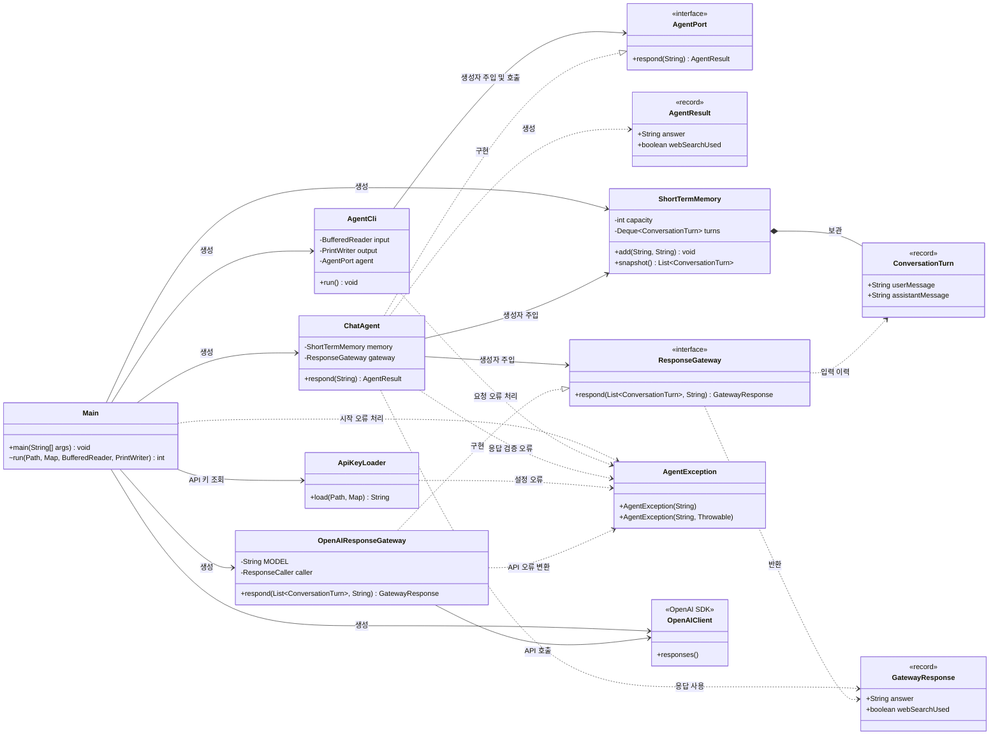
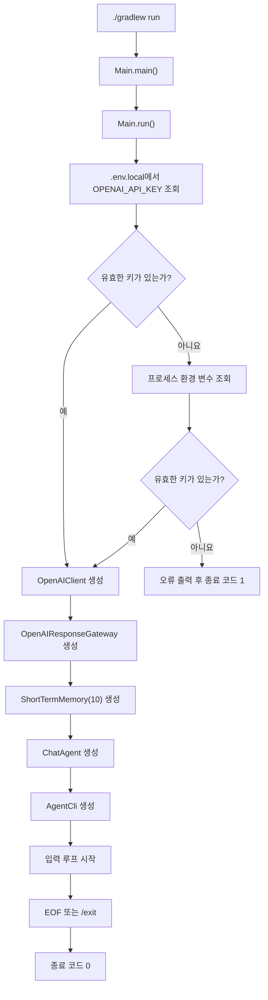
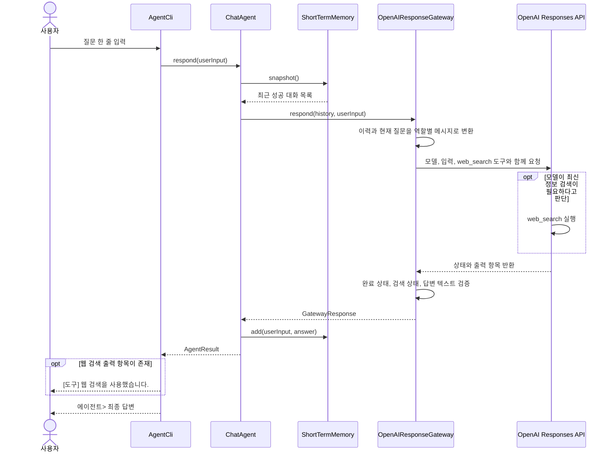
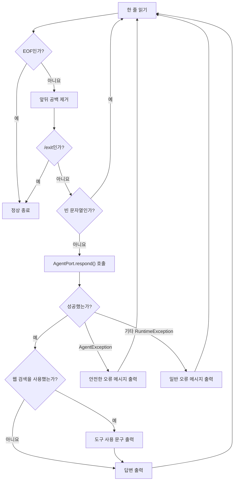
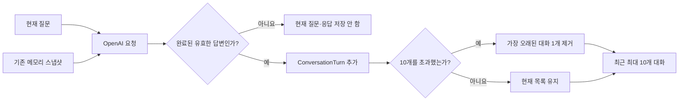
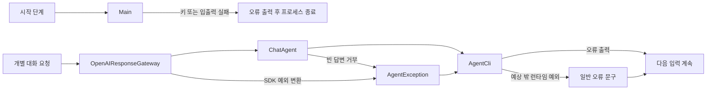

# Java Agent CLI 프로젝트 구조와 흐름

## 1. 프로젝트 개요

이 프로젝트는 Java 21 터미널에서 OpenAI Responses API와 연속 대화하는 최소 CLI 에이전트다. 사용자가 입력한 질문에 모델이 답하며, 필요한 경우 모델이 `web_search` 도구를 선택한다. 성공한 대화는 프로세스 메모리에 최근 10개까지 보관되어 다음 요청의 문맥으로 사용된다.

핵심 특징은 다음과 같다.

- 터미널 표준 입력과 표준 출력으로 동작한다.
- `.env.local` 또는 프로세스 환경 변수에서 OpenAI API 키를 읽는다.
- `gpt-5.4-nano` 모델과 Responses API를 사용한다.
- 모델이 필요에 따라 `web_search` 도구를 자동으로 선택한다.
- 성공한 질문과 답변만 최근 10쌍까지 메모리에 저장한다.
- 요청 실패를 사용자용 메시지로 변환하고 다음 입력을 계속 받는다.
- 단위 테스트에서는 실제 OpenAI API를 호출하지 않는다.

## 2. 기술 구성

| 구분 | 내용 |
| --- | --- |
| 언어 | Java 21 |
| 빌드 도구 | Gradle Wrapper |
| OpenAI SDK | `com.openai:openai-java:4.52.0` |
| 모델 | `gpt-5.4-nano` |
| 외부 도구 | OpenAI Responses API의 `web_search` |
| 테스트 | JUnit 5 |
| 실행 진입점 | `com.example.agentcli.Main` |

## 3. 디렉터리 구조

```text
java-agent-cli/
├── build.gradle                         # Java, 의존성, 실행·테스트 설정
├── settings.gradle                      # Gradle 프로젝트 이름
├── gradlew                              # Unix 계열 Gradle Wrapper
├── gradlew.bat                          # Windows Gradle Wrapper
├── README.md                            # 설치, 실행, 범위 안내
├── docs/
│   └── guide/
│       └── PROJECT_GUIDE.md             # 프로젝트 구조와 흐름 가이드
└── src/
    ├── main/java/com/example/agentcli/
    │   ├── Main.java                    # 프로그램 진입점과 객체 조립
    │   ├── application/                 # 유스케이스와 입출력 계약
    │   ├── cli/                         # 터미널 입출력 어댑터
    │   ├── config/                      # API 키 로딩
    │   ├── domain/                      # 대화와 단기 메모리 모델
    │   ├── exception/                   # 애플리케이션 공통 예외
    │   └── infrastructure/openai/       # OpenAI Responses API 연동
    └── test/java/com/example/agentcli/  # 운영 코드와 같은 패키지 구조의 단위 테스트
```

### 패키지별 역할

- `com.example.agentcli`
  - 애플리케이션 실행과 의존성 조립을 담당한다.
- `application`
  - 사용자의 질문에 답하는 유스케이스를 정의한다.
  - CLI와 외부 API 구현이 직접 결합되지 않도록 포트를 제공한다.
- `cli`
  - 터미널 입력을 해석하고 결과 또는 오류 메시지를 출력한다.
- `config`
  - API 키의 위치와 우선순위를 관리한다.
- `domain`
  - 대화 한 쌍과 최근 대화 목록을 관리한다.
- `infrastructure.openai`
  - 애플리케이션 요청을 OpenAI SDK 요청으로 바꾸고, SDK 응답과 예외를 애플리케이션 형식으로 변환한다.
- `exception`
  - 사용자에게 안전하게 전달할 수 있는 애플리케이션 예외를 제공한다.

## 4. 전체 계층 구조



의존성은 바깥쪽 입출력 구현이 애플리케이션 포트를 바라보는 형태다. `AgentCli`는 `ChatAgent` 구체 타입이 아니라 `AgentPort`에 의존하고, `ChatAgent`는 OpenAI 구현체가 아니라 `ResponseGateway`에 의존한다. `Main`이 실제 구현 객체를 생성하여 연결한다.

## 5. 클래스별 역할

### 실행 및 설정

| 클래스 | 종류 | 역할 | 주요 의존성 |
| --- | --- | --- | --- |
| `Main` | 클래스 | 프로그램의 진입점이다. 입출력 스트림, API 키, OpenAI 클라이언트, 메모리, 게이트웨이, 에이전트, CLI를 생성하고 연결한다. 시작 단계 오류를 출력하고 종료 코드를 결정한다. | `ApiKeyLoader`, `OpenAIClient`, `ShortTermMemory`, `OpenAIResponseGateway`, `ChatAgent`, `AgentCli` |
| `ApiKeyLoader` | 클래스 | 프로젝트 루트의 `.env.local`을 먼저 확인하고, 값이 없으면 프로세스 환경 변수의 `OPENAI_API_KEY`를 사용한다. 키가 없거나 파일을 읽지 못하면 `AgentException`을 발생시킨다. | `Path`, `Files`, `AgentException` |

### CLI 계층

| 클래스 | 종류 | 역할 | 주요 의존성 |
| --- | --- | --- | --- |
| `AgentCli` | 클래스 | 한 줄씩 입력을 읽는다. 빈 줄은 무시하고 `/exit`이면 종료한다. 유효한 입력은 `AgentPort.respond()`에 전달한다. 웹 검색 사용 안내, 답변, 안전한 오류 메시지를 출력하며 요청 실패 후에도 입력 루프를 유지한다. | `BufferedReader`, `PrintWriter`, `AgentPort`, `AgentResult`, `AgentException` |

### 애플리케이션 계층

| 클래스 | 종류 | 역할 | 주요 의존성 |
| --- | --- | --- | --- |
| `AgentPort` | 함수형 인터페이스 | CLI가 사용할 에이전트 유스케이스 계약이다. 사용자 입력을 받아 `AgentResult`를 반환한다. | `AgentResult`, `AgentException` |
| `ChatAgent` | 클래스 | 현재 메모리의 스냅샷과 새 질문을 게이트웨이에 전달한다. 유효한 답변만 메모리에 저장하고 CLI용 결과로 변환한다. | `AgentPort`, `ShortTermMemory`, `ResponseGateway`, `GatewayResponse`, `AgentResult` |
| `AgentResult` | 레코드 | CLI에 전달할 최종 답변과 웹 검색 사용 여부를 보관한다. 답변은 `null`일 수 없다. | 없음 |

### 도메인 계층

| 클래스 | 종류 | 역할 | 주요 의존성 |
| --- | --- | --- | --- |
| `ShortTermMemory` | 클래스 | 성공한 대화 쌍을 입력 순서대로 보관한다. 용량을 초과하면 가장 오래된 대화를 제거하고, 외부에는 변경할 수 없는 스냅샷을 제공한다. | `ConversationTurn`, `ArrayDeque` |
| `ConversationTurn` | 레코드 | 사용자 질문 한 개와 에이전트 답변 한 개를 한 쌍으로 표현한다. 두 값 모두 `null`일 수 없다. | 없음 |

### OpenAI 인프라 계층

| 클래스 | 종류 | 역할 | 주요 의존성 |
| --- | --- | --- | --- |
| `ResponseGateway` | 함수형 인터페이스 | 애플리케이션 계층이 외부 응답 생성 기능을 호출하는 계약이다. 대화 이력과 현재 입력을 받아 `GatewayResponse`를 반환한다. | `ConversationTurn`, `GatewayResponse`, `AgentException` |
| `OpenAIResponseGateway` | 클래스 | 대화 이력을 Responses API 입력 메시지로 구성하고 `gpt-5.4-nano`와 `web_search` 도구를 설정한다. 응답 완료 상태, 웹 검색 상태, 출력 텍스트를 검증하고 SDK 예외를 안전한 `AgentException`으로 변환한다. | `ResponseGateway`, `OpenAIClient`, OpenAI Responses SDK, `ConversationTurn`, `GatewayResponse` |
| `GatewayResponse` | 레코드 | OpenAI 어댑터가 애플리케이션 계층에 전달할 답변과 웹 검색 사용 여부를 보관한다. | 없음 |

### 공통 예외

| 클래스 | 종류 | 역할 | 주요 의존성 |
| --- | --- | --- | --- |
| `AgentException` | 검사 예외 | 설정, 외부 API, 응답 검증 단계의 실패를 사용자에게 노출 가능한 안전한 메시지로 전달한다. 필요하면 원래 예외를 원인으로 보존한다. | `Exception` |

## 6. 클래스 의존성 구조도

아래 구조도에서 실선 화살표는 호출 또는 객체 참조, 점선 삼각 화살표는 인터페이스 구현, 점선 화살표는 데이터 전달 관계를 뜻한다.



### 핵심 의존성 목록

1. `Main`은 모든 구체 객체를 생성하는 조립 지점이다.
2. `AgentCli`는 `AgentPort`에만 의존하므로 에이전트 구현을 교체하거나 테스트 대역을 주입할 수 있다.
3. `ChatAgent`는 `ResponseGateway`에만 의존하므로 실제 OpenAI 호출 없이 유스케이스를 테스트할 수 있다.
4. `OpenAIResponseGateway`가 OpenAI Java SDK에 직접 의존하며 SDK 세부 사항을 인프라 패키지 안에 한정한다.
5. `ShortTermMemory`는 `ConversationTurn`을 소유하고, 저장된 컬렉션 자체는 외부에 노출하지 않는다.
6. 계층 간 결과는 `AgentResult`와 `GatewayResponse`로 전달된다.

## 7. 프로그램 시작 흐름



API 키의 우선순위는 다음과 같다.

1. 실행 디렉터리의 `.env.local`에 있는 `OPENAI_API_KEY`
2. 프로세스 환경 변수의 `OPENAI_API_KEY`
3. 두 위치 모두 값이 없으면 시작 실패

`Main`은 애플리케이션 시작 전의 `AgentException`과 터미널 입력을 읽는 중 발생한 `IOException`을 처리한다. 시작 단계에서 실패하면 입력 루프가 열리지 않고 종료 코드 `1`을 반환한다.

## 8. 정상 대화 처리 흐름



### 요청 데이터 구성 순서

게이트웨이는 저장된 각 대화를 다음 순서로 펼친 후 현재 질문을 마지막에 추가한다.

1. 이전 사용자 질문
2. 이전 에이전트 답변
3. 다음 사용자 질문
4. 다음 에이전트 답변
5. 현재 사용자 질문

예를 들어 메모리에 두 개의 대화가 있으면 Responses API의 입력 역할 순서는 `user → assistant → user → assistant → user`가 된다.

`web_search` 도구는 요청에 항상 하나 등록되지만, 도구 선택을 강제하는 `tool_choice`는 지정하지 않는다. 따라서 실제 검색 여부는 모델이 결정한다. 응답에 완료된 웹 검색 호출 항목이 있을 때만 `webSearchUsed`가 `true`가 된다.

## 9. 입력 분기와 반복 처리



CLI 단계의 규칙은 다음과 같다.

- 입력은 `trim()` 처리되므로 앞뒤 공백은 질문에 포함되지 않는다.
- 빈 줄은 에이전트를 호출하지 않고 무시한다.
- `/exit`은 에이전트를 호출하지 않고 즉시 루프를 끝낸다.
- `AgentException`은 예외에 담긴 안전한 메시지를 출력한다.
- 그 밖의 런타임 예외는 원래 메시지를 노출하지 않고 일반 오류 문구로 대체한다.
- 개별 요청이 실패해도 프로그램은 종료되지 않고 다음 질문을 받는다.

## 10. 단기 메모리 흐름



메모리 정책은 다음과 같다.

- 저장 단위는 `ConversationTurn(userMessage, assistantMessage)` 한 쌍이다.
- 기본 실행 구성의 용량은 10쌍이다.
- 새 대화는 목록의 마지막에 추가된다.
- 10쌍을 초과하면 가장 오래된 한 쌍을 제거한다.
- 게이트웨이 요청 또는 응답 검증이 실패한 대화는 저장하지 않는다.
- 메모리는 프로세스 내부에만 존재하므로 프로그램을 종료하면 사라진다.
- `snapshot()`은 내부 덱을 직접 노출하지 않고 복사된 읽기 전용 목록을 반환한다.

## 11. 응답 검증 및 오류 처리

### 응답 검증 순서

`OpenAIResponseGateway`는 다음 조건을 순서대로 확인한다.

1. 응답에 오류가 있거나 상태가 `FAILED`이면 요청 실패로 처리한다.
2. incomplete 정보가 있거나 상태가 `COMPLETED`가 아니면 미완료 응답으로 처리한다.
3. 웹 검색 호출이 있다면 모든 검색 상태가 `COMPLETED`인지 확인한다.
4. 메시지 출력 항목의 텍스트를 줄바꿈으로 연결한다.
5. 최종 텍스트가 비어 있으면 유효하지 않은 답변으로 처리한다.
6. 모든 검증을 통과하면 답변과 웹 검색 사용 여부를 반환한다.

부분 답변이 포함되어 있더라도 전체 응답 또는 웹 검색이 완료되지 않았다면 성공으로 처리하지 않는다. 따라서 부분 답변이 CLI에 출력되거나 메모리에 저장되지 않는다.

### SDK 예외 변환 목록

| 원인 | 사용자에게 출력되는 의미 |
| --- | --- |
| HTTP `401`, `403` | API 키 또는 모델 접근 권한 확인 |
| HTTP `429` | 결제 상태 또는 API 사용 한도 확인 |
| HTTP `5xx` | OpenAI 서비스의 일시적 오류 안내 |
| `OpenAIIoException` | 네트워크 연결 상태 확인 |
| `OpenAIInvalidDataException` | 유효한 답변 처리 실패 |
| 기타 `OpenAIException` | OpenAI 요청 처리 실패 |
| 그 밖의 런타임 예외 | 예상하지 못한 오류 안내 |

원래 SDK 예외는 원인으로 보존하지만, 인증 헤더나 내부 예외 메시지가 터미널에 그대로 출력되지 않도록 사용자용 메시지로 치환한다.

### 오류 처리 경계



## 12. 테스트 구조

| 테스트 클래스 | 확인하는 책임 |
| --- | --- |
| `MainTest` | API 키가 없을 때 안전하게 시작을 중단하는지, 첫 입력이 `/exit`이면 API 호출 없이 정상 종료하는지 확인한다. |
| `AgentCliTest` | 요청 실패 후 입력 반복 유지, 예상 밖 오류 메시지 비공개, 빈 줄과 `/exit` 처리, 웹 검색 안내 출력을 확인한다. |
| `ChatAgentTest` | 이력과 현재 질문 전달, 성공한 대화 저장, 실패한 대화 미저장, 빈 답변 거부를 확인한다. |
| `ShortTermMemoryTest` | 대화 순서 유지, 용량 초과 시 가장 오래된 대화 제거, 잘못된 용량 거부를 확인한다. |
| `ApiKeyLoaderTest` | `.env.local` 우선순위, 따옴표 제거, 환경 변수 대체 경로, 키 누락 오류를 확인한다. |
| `OpenAIResponseGatewayTest` | 요청 메시지 순서와 도구 설정, 실제 SDK 출력 변환, 부분·검색 실패 거부, 네트워크 및 HTTP 오류 메시지 변환을 확인한다. |

테스트가 인터페이스와 패키지 전용 생성자를 통해 대역을 주입하므로 외부 OpenAI API나 네트워크에 의존하지 않는다.

## 13. 실행과 확인

### API 키 설정

프로젝트 루트에 `.env.local`을 만들거나 프로세스 환경 변수를 사용한다.

```dotenv
OPENAI_API_KEY=your-api-key
```

키는 소스 코드, 문서, 테스트 출력에 기록하지 않는다.

### 프로그램 실행

```bash
./gradlew run --console=plain
```

### 테스트 실행

```bash
./gradlew test
```

## 14. 현재 범위와 제약

현재 구현에 포함되지 않은 기능은 다음과 같다.

- 스트리밍 응답
- 파일 또는 데이터베이스 기반 장기 메모리
- 다중 사용자 및 사용자별 대화 분리
- 웹 UI
- 음성·이미지 입력
- `web_search` 이외의 추가 도구
- 실패 요청 자동 재시도
- 프로세스 재시작 후 대화 복구

따라서 이 프로젝트의 메모리와 대화 상태는 단일 CLI 프로세스의 실행 시간에만 유효하다.
